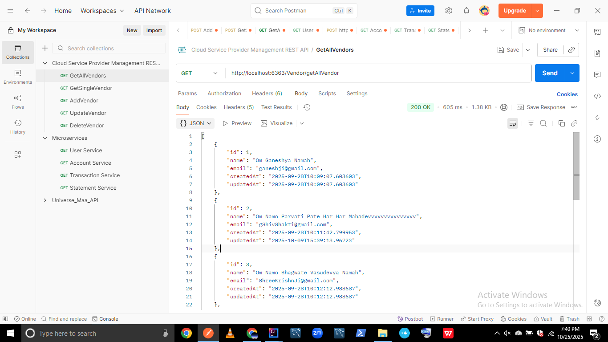

# ☁️ Cloud Service Provider Management REST API

A backend project demonstrating real-world Spring Boot REST API development using clean layered architecture (Controller → Service → Repository), DTOs, global exception handling, validation, and unit testing with JUnit and Mockito. Built with dedication during my career break to master backend development.


---

## 🚀 Tech Stack

- Java 21  
- Spring Boot 3.x  
- Spring Data JPA + Hibernate  
- MySQL  
- DTO + Validation  
- Global Exception Handling  
- Unit Testing (JUnit + Mockito)  
- Postman for API testing  

---

## 📁 Project Structure

| Layer | Link |
|-------|------|
| 🧾 Controller | [ControllerLayer.java](https://github.com/siddharth0161820/cloud-service-provider-management-api/tree/master/src/main/java/com/cloudvendor/cloudvendor/ControllerLayer) |
| 🧠 Service | [ServiceLayer](https://github.com/siddharth0161820/cloud-service-provider-management-api/tree/master/src/main/java/com/cloudvendor/cloudvendor/ServiceLayer) |
| 💾 Repository | [RepositoryLayer.java](https://github.com/siddharth0161820/cloud-service-provider-management-api/tree/master/src/main/java/com/cloudvendor/cloudvendor/RepositoryLayer) |
| 🧱 Entity | [CloudVendor.java](https://github.com/siddharth0161820/cloud-service-provider-management-api/tree/master/src/main/java/com/cloudvendor/cloudvendor/ModelEntity) |
| 📦 DTO | [VendorRequestDTO & VendorResponseDTO](https://github.com/siddharth0161820/cloud-service-provider-management-api/tree/master/src/main/java/com/cloudvendor/cloudvendor/CloudVendorDTO) |
| 🚨 Global Exception | [GlobalExceptionHandler.java](https://github.com/siddharth0161820/cloud-service-provider-management-api/tree/master/src/main/java/com/cloudvendor/cloudvendor/GlobalExceptionHandling) |
| 🧪 Unit Test | [TestServiceLayer.java](https://github.com/siddharth0161820/cloud-service-provider-management-api/tree/master/src/test/java/com/cloudvendor/cloudvendor/ServiceLayer) |
| ▶️ Main App | [CloudvendorApplication.java](https://github.com/siddharth0161820/cloud-service-provider-management-api/blob/master/src/main/java/com/cloudvendor/cloudvendor/CloudvendorApplication.java) |

---

## ✅ Features

- Full CRUD operations for cloud vendors 
- DTO-based data transfer and request handling
- Input validation using annotations  
- Global and custom exception handling  
- Clean layered architecture (Controller → Service → Repository)  
- JUnit + Mockito-based unit tests  
- Manual API tested with Postman  

---

## 📮 API Endpoints – Postman Screenshots

### 1️⃣ GET /Vendor/getAllVendor
**Description:** Fetches all vendors  


```json
[
  {
    "id": 1,
    "name": "Om Ganeshya Namah",
    "email": "ganeshji@gmail.com",
    "createdAt": "2025-09-28T10:09:07.603603",
    "updatedAt": "2025-09-28T10:09:07.603603"
  },
  {
    "id": 2,
    "name": "Om Namo Parvati Pate Har Har Mahadevvvvvvvvvvvvvvv",
    "email": "gShivShakti@gmail.com",
    "createdAt": "2025-09-28T10:11:42.799953",
    "updatedAt": "2025-10-09T15:39:13.96723"
  },
  {
    "id": 3,
    "name": "Om Namo Bhagwate Vasudevya Namah",
    "email": "ShreeKrishnJi@gmail.com",
    "createdAt": "2025-09-28T10:12:12.988687",
    "updatedAt": "2025-09-28T10:12:12.988687"
  }
]
```
---

### 2️⃣ GET /Vendor/{id}
**Description:** Fetch vendor by ID  

```json
{
  "id": 2,
  "name": "Om Namo Parvati Pate Har Har Mahadevvvvvvvvvvvvvvv",
  "email": "gShivShakti@gmail.com",
  "createdAt": "2025-09-28T10:11:42.799953",
  "updatedAt": "2025-10-09T15:39:13.96723"
}
```
---

### 3️⃣ POST /Vendor/addVendor
**Description:** Adds a new vendor  

```json
Input
{
  "name": "Radhe Radhe",
  "email": "Gratitude@gmail.com"
}
Output
{
  "id": 155,
  "name": "Radhe Radhe",
  "email": "Gratitude@gmail.com",
  "createdAt": "2025-10-25T19:36:23.519069",
  "updatedAt": "2025-10-25T19:36:23.519069"
}
```
---

### 4️⃣ PUT /Vendor/updateVendor/{id}
**Description:** Updates vendor information  

```json
Input
{
  "id": 155,
  "name": "Radhe Radhe",
  "email": "Gratitude@gmail.com",
  "createdAt": "2025-10-25T19:36:23.519069",
  "updatedAt": "2025-10-25T19:36:23.519069"
}
Output
{
  "id": 155,
  "name": "Radhee Radhee",
  "email": "Gratitudehappiness@gmail.com",
  "createdAt": "2025-10-25T19:36:23.519069",
  "updatedAt": "2025-10-25T19:52:20.475787"
}
```
---

### 5️⃣ DELETE /Vendor/deleteVendor/{id}
**Description:** Deletes a vendor by ID   

```json
Example Request
http://localhost:6363/Vendor/deleteVendor/202
Output
Vendor details deleted
```
---

### Validation Errors
**Description:** Triggers validation errors when empty fields are provided.
**Endpoint:** POST /Vendor/addVendor

```json
Input
{
  "name": "",
  "email": ""
}
Output
{
  "name": "must not be empty",
  "email": "must not be empty"
}
```
---
### 7️⃣ Global Exception Handling
**Description:** Example of custom global exception handling when invalid ID is provided.
**Endpoint**: GET /Vendor/{id} or DELETE /Vendor/deleteVendor/{id}

```json
Output
{
  "message": "Vendor Details not found by Id: 234",
  "httpStatus": "NOT_FOUND"
}
}
```
---
## 🏗️ Architecture Overview
- Layers: Controller → Service → Repository
- Entity ↔ DTO for clean separation
- Exception handling via @ControllerAdvice
- MySQL integration via Spring Data JPA
  
---

## 🧪 Unit Testing

- Frameworks: JUnit 5 + Mockito  
- Class: `TestServiceLayer.java`  
- Scenarios: Valid CRUD logic, Invalid ID → NotFoundException, Invalid input → Validation exception  

---

## 👨‍💻 Author

**Sidharth Kumar**  

[](mailto:siddharth0161820@gmail.com)  
[](https://www.linkedin.com/in/siddharthkumar16)  
[](https://github.com/siddharth0161820)

🙏 Built with dedication during my career break to master backend development. Connect for collaboration, job opportunities, or tech discussions.


